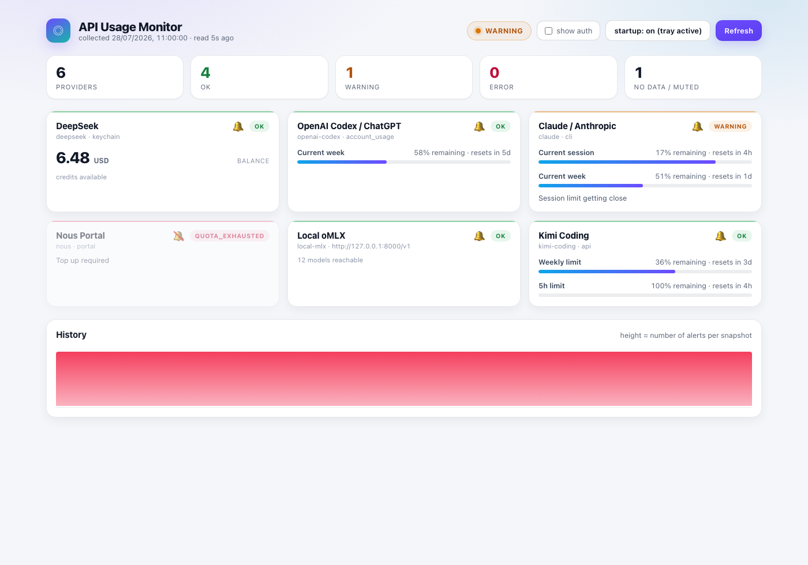
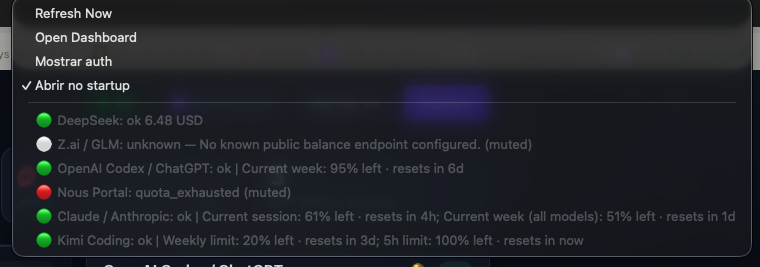

# usage-monitor

Provider-agnostic monitor for LLM **usage, balance, quota, and rate-limit state**.

One local app answers "how much do I have left, everywhere?" — subscription windows
(Claude, Kimi, Codex), prepaid credits (DeepSeek, Nous, Z.ai), and any
OpenAI-compatible endpoint you declare in a YAML file. Runs as a CLI, a local
FastAPI dashboard, a macOS menu bar app, or an optional [Hermes](#hermes-integration-optional)
plugin.

Providers are configuration, not code: most are declared in `providers.yaml`, and
anything unusual is a small Python adapter file.

<p align="center">
  
</p>

<p align="center">
  
</p>

## Quickstart

```bash
# 1. clone and create the virtualenv (Python >= 3.10)
git clone <repo-url> usage-monitor && cd usage-monitor
make setup

# 2. declare your providers and app settings
mkdir -p ~/.config/usagemon
cp examples/providers.yaml ~/.config/usagemon/providers.yaml
cp examples/config.yaml ~/.config/usagemon/config.yaml
security add-generic-password -a default -s api-usage-monitor/deepseek -w 'sk-...'

# 3. run the dashboard
make server        # http://127.0.0.1:9097
```

`make status` prints the same data in the terminal if you'd rather skip the server.
Every provider in `examples/providers.yaml` is a working example of one built-in
type, and most ship `enabled: false` — copy it as-is and switch on what you use.

Config and state live under `~/.config/usagemon/` by default
(`USAGE_MONITOR_HOME` overrides it). Hermes is optional: Hermes-backed provider
types report `unavailable` when Hermes is absent instead of breaking the app.

## Standalone app

```bash
usage-monitor status                     # table in the terminal
usage-monitor status --json --pretty     # machine-readable snapshot
usage-monitor latest --limit 5 --pretty  # last persisted snapshots
usage-monitor serve --port 9097          # refresh interval defaults to config.yaml (900s)
usage-monitor menubar                    # interval defaults to config.yaml (300s)
usage-monitor autostart --output-dir ./agents   # generate LaunchAgent plists
usage-monitor auth enable                # optional Basic Auth for dashboard + API
```

`usagectl` remains as a backwards-compatible alias for existing installs/scripts.

- **Dashboard** (`usage-monitor serve` / `make server`): light-theme provider cards,
  history charts, per-provider mute, a startup toggle, optional Basic Auth login,
  and English/Portuguese UI strings. `config.yaml` controls the default refresh
  interval, language, auth, and whether auth providers are shown by default.
- **Menu bar app** (`make tray`): overall icon (🟢/🟡/🔴/⚪) plus one line per
  provider. It reads the newest persisted snapshot instead of collecting on the UI
  thread, and `Refresh Now` delegates to the backend. Requires the optional
  `rumps` extra; without it the command exits with a clear message and code 2.
- **macOS autostart**: `usagectl autostart` only *generates* LaunchAgent plists —
  it never calls `launchctl` and writes only where you tell it to. `make
  install-tray` / `make uninstall-tray` do the loading step for you.
- **CLI on PATH**: `usage-monitor` and `usagectl` come from `make setup`
  (editable install) and need the venv active. `usagectl` is kept as a legacy
  alias for older scripts. `make install-cli` additionally drops a `usagemon`
  wrapper in `~/.local/bin` that pins this checkout's venv, so it works from any
  shell; `make uninstall-cli` removes it.
- **Snapshots**: appended to `~/.config/usagemon/snapshots.jsonl`.

Details and every flag: [docs/USAGE.md](docs/USAGE.md).

## Local API

The backend serves the same handlers under two prefixes: `/api/v1` (stable,
versioned — use this) and the historical unprefixed paths (kept for backwards
compatibility, used by the dashboard).

| Route | Method | Purpose |
|---|---|---|
| `/api/v1/status` | GET | Current status; `?persist=true` also appends a snapshot |
| `/api/v1/status/cached` | GET | Newest persisted snapshot (fast path) |
| `/api/v1/refresh` | POST | Collect and persist a snapshot |
| `/api/v1/latest?limit=N` | GET | Last `N` snapshots (1–500) |
| `/api/v1/history?limit=N` | GET | Same payload, named for chart consumers |
| `/api/v1/status.txt` | GET | Plain-text status |
| `/api/v1/status.json?pretty=true` | GET | JSON served as text |
| `/api/v1/overrides`, `/api/v1/overrides/{id}` | GET/POST | Per-provider relevance (mute) |
| `/api/v1/autostart[/install\|/uninstall]` | GET/POST | LaunchAgent state and management |

```bash
curl -s http://127.0.0.1:9097/api/v1/status | jq .overall
curl -sX POST http://127.0.0.1:9097/api/v1/refresh > /dev/null
```

The schema is browsable at `/docs` and `/openapi.json`.

> **Local only by default.** The server binds `127.0.0.1`. If you proxy it or
> want a browser gate, enable Basic Auth with `usagectl auth enable` or
> `USAGE_MONITOR_AUTH_PASSWORD`. `/api/v1/autostart/install` writes files into
> `~/Library/LaunchAgents`.

## Providers

| Provider | Source | Kind |
|---|---|---|
| DeepSeek | `api.deepseek.com/user/balance` | Credits |
| Kimi / Moonshot | Moonshot balance endpoint | Credits |
| Any OpenAI-compatible server | `/models` or `/credits` | Reachability / credits |
| Claude / Anthropic | Hermes Anthropic account usage | Subscription windows |
| OpenAI Codex / ChatGPT | Hermes `account_usage` | Subscription windows |
| Nous Portal | Portal credit lines via Hermes | Credits |
| Z.ai / GLM | Placeholder entry | — |
| Hermes auth / `state.db` | `hermes auth list`, read-only SQLite | Auth state / recorded usage |

Types whose source says "Hermes" report `unavailable` when Hermes is absent —
they never fail the run. Full type list, credential sources, and env vars:
[docs/CONFIGURATION.md](docs/CONFIGURATION.md).

## Configuration

```yaml
# ~/.config/usagemon/providers.yaml
defaults:
  timeout: 12

providers:
  - id: deepseek
    label: DeepSeek
    type: deepseek
    credential:
      source: keychain            # keychain | env | hermes | literal
      service: api-usage-monitor/deepseek
      account: default
```

```yaml
# ~/.config/usagemon/config.yaml
dashboard:
  language: en        # en | pt
  theme: light
  show_auth: false
intervals:
  refresh_seconds: 900
  menubar_seconds: 300
auth:
  enabled: false      # enable with: usagectl auth enable
```

Credentials come from the macOS Keychain (preferred), an env var, the Hermes
credential pool, or a literal value for local testing. Tokens are never written
to snapshots, plists, or the dashboard. See
[docs/CONFIGURATION.md](docs/CONFIGURATION.md).

## Extending

Add a config-only entry for simple HTTP providers, or drop a Python file into
`~/.config/usagemon/adapters/`:

```python
def check():
    return {
        "id": "my-provider",
        "label": "My Provider",
        "status": "ok",           # ok|warning|error|rate_limited|quota_exhausted|unknown|unavailable
        "source": "api",
        "balance": {"amount": 10.0, "currency": "USD"},
        "details": ["optional note"],
    }
```

`check()` may return a dict, a `ProviderStatus`, or a list of either. Never return
API keys, tokens, or raw headers. Guide: [docs/EXTENDING.md](docs/EXTENDING.md).

## Hermes integration (optional)

Everything above works without Hermes, and nothing here is required to run the
app. If you do run Hermes, `scripts/install-hermes-integration.sh` wires the
monitor into it as a skill + plugin:

- copies the plugin backend to `~/.hermes/plugins/api-usage-monitor/`;
- copies the Desktop plugin UI (`plugin/desktop/plugin.js`) to
  `~/.hermes/desktop-plugins/api-usage-monitor/` — a status bar chip, a right-hand
  pane with the provider table, and an `API Usage: Refresh` palette command, all
  reading the plugin's own REST routes;
- installs the `api-usage-monitoring` skill and `scripts/usagectl.py`;
- seeds `providers.example.yaml` / `prices.example.yaml` and example LaunchAgent
  templates (copied only, never loaded);
- runs `hermes plugins enable api-usage-monitor`.

It never touches the standalone install: `~/.local/bin/usagemon`, the
LaunchAgents, and `~/.config/usagemon` are left alone.

The plugin backend mirrors the data routes under
`/api/plugins/api-usage-monitor/` once the gateway restarts. Hermes-backed
provider types (`hermes-auth`, `hermes-account-usage`, `anthropic-subscription`,
`hermes-nous`, `hermes-state-db`) become useful at that point.

> `hermes plugins enable` may warn `Plugin 'api-usage-monitor' is not installed
> or bundled`. That is harmless: the `dist/index.js` named by
> `plugin/manifest.json` is a placeholder, not a built bundle — there is no build
> step here — so Hermes may not recognize the directory as an installed plugin.
> The Desktop UI is loaded from `desktop-plugins/` and is unaffected, as are the
> plugin REST routes. The standalone backend, tray, and CLI are
> unaffected.

`scripts/uninstall-hermes-integration.sh` removes what that installer created
and preserves `~/.config/usagemon/snapshots.jsonl`.

## Snapshot format

```json
{
  "checked_at": "2026-07-25T00:00:00Z",
  "overall": "ok|unknown|warning|error",
  "providers": [
    {
      "id": "claude",
      "label": "Claude / Anthropic",
      "status": "ok",
      "source": "cli|api|credential_pool|hermes_account_usage",
      "balance": {"amount": 12.34, "currency": "USD"},
      "usage": {"amount": 8.90, "currency": "USD"},
      "windows": [
        {"label": "Weekly", "used_percent": 42, "remaining_percent": 58,
         "reset_at": "2026-07-30T00:00:00Z"}
      ],
      "details": ["optional notes"],
      "message": "optional warning/error"
    }
  ],
  "alerts": [],
  "meta": {"external_adapter_dir": "~/.config/usagemon/adapters"}
}
```

## Docs

- [Usage](docs/USAGE.md) — CLI, dashboard, tray, autostart, HTTP endpoints
- [Configuration](docs/CONFIGURATION.md) — `providers.yaml`, credentials, env vars, prices
- [Extending](docs/EXTENDING.md) — config-only checks and Python adapters
- [Architecture](docs/ARCHITECTURE.md) — package/plugin split and data flow
- [Contributing](CONTRIBUTING.md) — setup, tests, PR checklist
- [Roadmap](docs/ROADMAP.md) · [Changelog](CHANGELOG.md)

## Development

```bash
make setup    # .venv with dev + menubar extras
make test     # pytest + compileall + shell syntax + git diff --check
make security-scan  # gitleaks + trufflehog
make server   # local dashboard
```

Contributing does not require Hermes — see [CONTRIBUTING.md](CONTRIBUTING.md).

## License

MIT — see [LICENSE](LICENSE).
